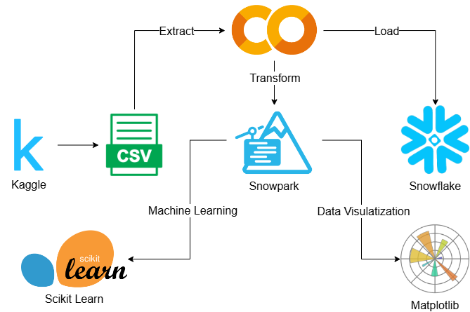
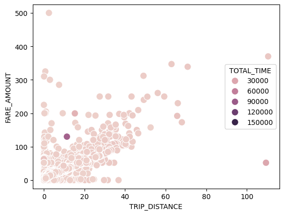
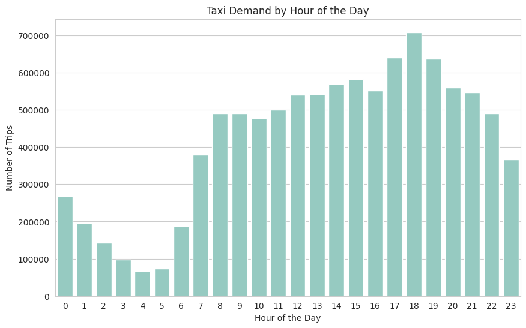
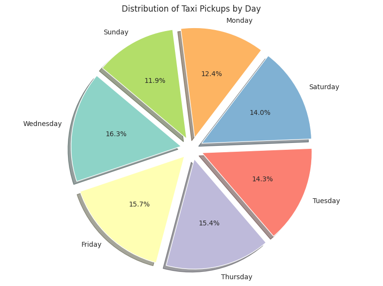
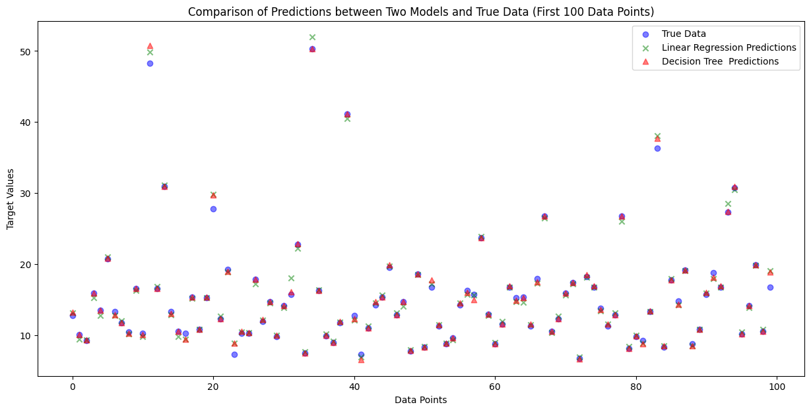

  <h1> Taxi Trips Exploration</h1>
  
  
  
  
  
  
  
  
  
  
  
  

  <h3>  From Kaggle to Snowflake in a flash, this script streams taxi trips for anaylsis, visualizations and machine learning!</h3>
  
  

## :star2: About The Project

- [Taxi Trip Dataset](https://www.kaggle.com/datasets/anandshaw2001/taxi-dataset) represents a detailed compilation of trips made using yellow taxis in New York City.
- Encapsulates a wide range of information, from pickup and drop off times to fare amounts and payment types, offering a comprehensive view into urban mobility and 
the economics of taxi rides within the city.
- Invaluable for urban transportation trends, fare analysis, geographic movement patterns within New York City, and the study of temporal variations in taxi usage.

## 📈 Sample Visualizations
**Please check code inside notebooks with more visualizations and detailed explanations**

